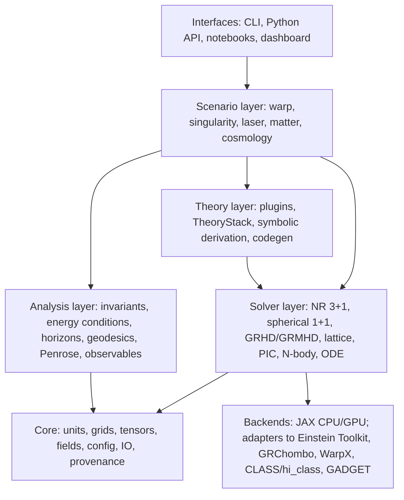

# ParticleSim Design Document

| | |
|---|---|
| **Status** | v0.2, merged baseline; revised per review discussion |
| **Date** | 2026-09-17 |
| **Scope** | Cosmology, warp drive design, particle lasers, matter, singularities, with pluggable theories of everything (ToEs) |
| **Default theory family** | String-inspired effective field theory (EFT) |
| **License** | GPL-3.0 (already in repo) |

---

## 0. Summary

ParticleSim is a research simulation framework with five scenario families
(cosmology, warp drives, particle lasers, matter, singularities) that all run on
top of one **Theory plugin layer**. A theory plugin declares the field content
and the action (or, for symmetry-reduced quantum-gravity models, the corrected
equations of motion), and the framework derives the equations of motion,
performs the 3+1 split, and generates numerical kernels. Swapping the theory
does not change the scenario, the solver, or the analysis tooling. That is the
mechanism by which "multiple theories of everything" is supported.

The three decisions that shape everything else:

1. **Theory as data.** A theory is a declarative object (fields, action,
   couplings, regime of validity, hyperbolic formulation). Scenarios and
   solvers never hard-code a specific gravity or matter law.
2. **String theory enters through its computable faces.** Full string theory
   is not directly simulable. What is simulable, and what this framework
   implements, is (a) its low-energy effective actions in 4D and in D = 4 + n
   with compactification, (b) string-derived matter sectors such as
   Born-Infeld electrodynamics, dilaton and axion fields, and string-inspired
   inflation potentials, and (c) in a later phase, non-perturbative matrix
   models (BFSS/BMN) via lattice Monte Carlo. Section 2 states this constraint
   explicitly so nobody mistakes an EFT result for a "prediction of string
   theory".
3. **Python orchestration, JAX kernels, symbolic derivation, adapters to
   established codes.** Autodiff gives warp-shape optimization and sensitivity
   analysis for free. Established codes (Einstein Toolkit, GRChombo, WarpX,
   CLASS/hi_class) are reached through adapters rather than reimplemented,
   once the in-house solvers hit their limits.

Delivery is staged (Section 14). Milestone 0 already gives a usable tool: a
warp metric analyzer that computes required stress-energy and energy-condition
violation maps for Alcubierre, Natário, Van Den Broeck, Lentz, and
Bobrick-Martire families under any Tier A theory plugin.

---

## 1. Motivation and goals

### 1.1 What the user wants to do

- **Simulate the universe:** evolve cosmological backgrounds, primordial
  perturbations, and (nonlinear) structure formation under a chosen theory,
  and compare observables across theories.
- **Design warp drives:** parameterize warp metrics, compute the stress-energy
  they require, test energy conditions and causality, evolve test fields and
  passengers on the background, optimize the shape function, and see how the
  answer changes under string-inspired or other modified gravity.
- **Simulate particle lasers:** laser-plasma wakefield accelerators, free
  electron lasers (FELs), strong-field QED effects, and their modifications
  under string-derived electrodynamics (Born-Infeld, axion-photon coupling).
- **Simulate matter:** relativistic fluids and magnetized plasmas coupled to
  gravity, lattice quantum fields, and gravitational N-body systems, with
  swappable equations of state.
- **Test hypotheses about singularities:** express a hypothesis as a
  modification to the action, the reduced equations, or the matter model;
  run a standard battery of collapse and cosmological scenarios; get a report
  that says whether the hypothesis regularizes the singularity, whether it
  recovers general relativity (GR) in the weak-field limit, and what it
  predicts observationally.

### 1.2 Goals

| ID | Goal | Measurable form |
|---|---|---|
| G1 | Theory pluggability | Any scenario runs unchanged under at least GR, one string-EFT plugin, and one loop-quantum-gravity (LQG) effective plugin by Milestone 4 |
| G2 | Scientific credibility | Every solver reproduces a published benchmark to stated tolerance (Section 10) before it is used for new results |
| G3 | Hypothesis turnaround | A user-authored singularity hypothesis goes from a Python file to a report card in under one hour of compute on one GPU for the spherical battery |
| G4 | Reproducibility | Every run is re-creatable from its manifest (config hash, commit, seeds, environment) |
| G5 | Extensibility | Adding a theory, a scenario, or a solver never requires editing another package's code (plugin entry points) |

### 1.3 Users

Primary: a single researcher/developer (the repo owner) running experiments on
a workstation or single-GPU cloud box. Secondary: collaborators reading
results and adding theories. Design for one person, do not preclude a team.

---

## 2. Non-goals and honesty constraints

This section is deliberately blunt so that the framework does not overclaim.

1. **We do not simulate string theory itself.** There is no known lattice
   formulation of the full perturbative superstring in 10D, and the theory has
   no unique 4D vacuum (the landscape problem). "Based on string theory" here
   means: the field content and interaction terms come from string-derived
   low-energy actions (NS-NS sector, α' corrections, DBI/Born-Infeld, moduli
   from compactification) and, later, matrix-model Monte Carlo. Every
   string-family plugin carries a `provenance` string stating exactly which
   truncation and which frame it implements.
2. **No ToE is validated by this framework.** The framework compares theories
   against each other and against known GR/QFT limits. It cannot decide
   which theory is true.
3. **Planck-regime results are theory-dependent by construction.** Results
   inside a plugin's declared regime of validity are trustworthy as
   numerical solutions of that theory; results outside it are flagged and
   should be treated as exploratory.
4. **Warp drives require stress-energy that violates energy conditions in GR
   and in every generic case studied** (Santiago, Schuster, Visser 2022). The
   framework quantifies the violation, searches for designs that minimize it,
   and reports how modified theories change the accounting. It makes no claim
   about engineering feasibility.
5. **Hypotheses must be mathematical.** A hypothesis about singularities is
   simulable only when written as an action term, a modified equation, a
   metric family, an equation of state, or a boundary condition. The
   framework provides an authoring guide and templates (Section 8), not
   natural-language-to-physics translation.
6. **Out of scope for v1:** molecular dynamics and condensed matter (reach
   via adapters later), full 3D adaptive mesh refinement (AMR) in-house
   (use GRChombo/Einstein Toolkit adapters), quantum-circuit simulation,
   radiative transfer, neutrino transport.

---

## 3. Physics scope by domain

Each domain lists what is simulated, what the theory plugin changes, key
outputs, and the validation benchmark that gates first use.

### 3.1 Cosmology ("simulate the universe")

Fidelity ladder, each level a separate module that consumes the theory plugin:

| Level | Module | Content | Theory plugin hook |
|---|---|---|---|
| C0 | `cosmo.background` | Homogeneous, isotropic background: generalized Friedmann equations as ODEs; radiation, matter, Λ, scalar fields, fluids with arbitrary equation of state | Plugin supplies the reduced (FLRW) equations of motion, e.g. LQC's `H² = (8πG/3) ρ (1 − ρ/ρ_c)`, or the framework derives them from the action |
| C1 | `cosmo.inflation` | Single- and multi-field inflation, slow-roll and full numerical, Mukhanov-Sasaki mode evolution, primordial power spectra and n_s, r | String-inspired potentials (KKLT-type, fibre inflation, axion monodromy, D-brane inflation); alternative early-universe scenarios (string gas, pre-big-bang, ekpyrotic) as background modules |
| C2 | `cosmo.linear` | Linear perturbations, CMB angular power spectra, matter power spectrum | Adapter to CLASS/hi_class for Horndeski-class theories; in-house Boltzmann solver is a non-goal |
| C3 | `cosmo.nbody` | Nonlinear structure formation, particle-mesh (PM) then TreePM; modified-gravity scalar field solved by multigrid (ECOSMOG/MG-GADGET style) | Plugin supplies the quasi-static scalar equation and screening mechanism |
| C4 | `cosmo.lattice` | Real-time classical-statistical lattice evolution of scalar/gauge fields for preheating, phase transitions, defect formation | Plugin supplies field content and potential |

Outputs: H(z), distance measures, primordial P(k), n_s, r, CMB C_ℓ (via
adapter), matter P(k), halo mass function, bounce diagnostics for bouncing
cosmologies.

Gate benchmark: C0 reproduces ΛCDM distances to 1e-8 relative against astropy;
LQC plugin reproduces the bounce at ρ_c ≈ 0.41 ρ_Planck; C1 reproduces the
Starobinsky leading-order result n_s = 1 − 2/N (≈ 0.964 at N = 55 e-folds) to
three digits.

### 3.2 Warp drives

Two operating modes, in order of implementation.

**Mode W1, metric analysis (static).** Given a metric family with parameters,
compute symbolically and numerically:

- Einstein tensor, and therefore the stress-energy tensor the theory requires
  (for modified theories, the *effective* stress-energy defined by the plugin,
  which separates matter from geometric contributions explicitly).
- Energy conditions pointwise and integrated: null (NEC), weak (WEC), strong
  (SEC), dominant (DEC). Violation maps and total violating energy.
- Optional Ford-Roman quantum inequality check as a plausibility bound on
  negative energy regions.
- Expansion scalar of the shift (the York time θ), Kretschmann and other
  curvature invariants, tidal tensor along passenger worldlines, horizons for
  superluminal bubbles, closed timelike curve (CTC) detection for
  multi-bubble configurations.
- Geodesic and test-field propagation on the background (light rays, sound
  waves, a scalar field), to study passenger safety and signal behavior.

Built-in metric families: Alcubierre (1994), Natário (2002, zero-expansion),
Van Den Broeck (1999, volume pocket), Lentz (2021, soliton; with the Fell and
Heisenberg 2021 objections encoded as a check), Bobrick and Martire (2021,
physical warp drives classification), Fuchs et al. (2024, constant-velocity
subluminal positive-energy solution). Shape functions are parameterized
(thickness σ, radius R, velocity profile) and any user-defined shape function
is accepted as a symbolic expression or a callable.

**Mode W2, design search.** Because kernels are JAX, the violation integral is
differentiable in the shape parameters. A design search minimizes a chosen
objective (total negative energy, peak |ρ|, tidal stress) subject to
constraints (bubble velocity, passenger region size, positivity where
demanded). Results are reported with the theory that produced them.

**Mode W3, dynamical evolution (Milestone 4+).** Evolve the 3+1 spacetime
with a specified matter model that is meant to source the bubble, and check
whether the configuration persists, disperses, or forms horizons. This mode
is honest about the fact that most warp metrics have no known sourcing
matter; the user supplies a candidate (scalar field, fluid with exotic
equation of state, Casimir-like effective stress-energy) and the simulation
answers whether it works.

Gate benchmark: Alcubierre energy density for Eulerian observers matches the
closed form `ρ = −(v_s² /(32π)) ((y² + z²)/r_s²) (df/dr_s)²` (geometric units)
to round-off on a 3D grid; total NEC violation for Natário matches the
published zero-expansion property (θ = 0 everywhere).

### 3.3 Particle lasers

"Particle laser" is interpreted as the family of coherent particle-beam and
laser-particle systems. If the intended meaning is narrower, the scope
narrows without changing the architecture. Covered:

- **Laser wakefield acceleration (LWFA)** and plasma wakefield acceleration:
  particle-in-cell (PIC) simulation of Vlasov-Maxwell with macro-particles.
- **Free-electron lasers (FELs):** electron beam in an undulator radiating
  coherently; PIC in 1D/2D with a wiggler field, and a period-averaged FEL
  model for long undulators.
- **Strong-field QED:** photon emission by radiating electrons, nonlinear
  Breit-Wheeler pair production, radiation reaction, for intensities
  approaching the Schwinger field (≈ 1.3e18 V/m). Monte Carlo QED module on
  top of PIC.
- **Beam transport and instabilities:** two-stream, Weibel, filamentation,
  hosing.

Theory plugin hooks: the electromagnetic sector is swappable. GR baseline uses
Maxwell; the string family provides Born-Infeld (from the D-brane DBI action)
and axion-photon coupling (string axions); QED provides Euler-Heisenberg. The
field solver takes the plugin's constitutive relation D(E, B), H(E, B), so
nonlinear electrodynamics is a plugin, not a fork of the solver.

Outputs: fields and phase-space snapshots, beam emittance and energy spectra,
FEL gain curve and saturation power, pair yield, spectra of emitted photons.

Gate benchmark: cold plasma oscillation at ω_p to 1e-4; two-stream growth
rate to 2% against linear theory; 1D LWFA wake amplitude against the
nonlinear 1D theory; FEL gain length `L_g = λ_u / (4π√3 ρ_Pierce)` to 5%.

### 3.4 Matter

Matter is layered by scale. v1 implements the tiers that couple to gravity
and to the field theories the other domains need.

| Tier | Module | Content | Coupling |
|---|---|---|---|
| Fluids | `matter.grhd`, `matter.grmhd` | General-relativistic hydrodynamics and MHD in the Valencia (conservative) formulation; equation-of-state (EOS) plugins: ideal gas, polytrope, piecewise polytrope, tabulated nuclear EOS | Consumes the metric and connection from the NR solver; the theory plugin decides the frame (Einstein vs Jordan) and any non-minimal matter coupling |
| Lattice fields | `matter.lattice` | Scalar φ⁴, U(1) and SU(N) gauge theories: Euclidean Hybrid Monte Carlo for equilibrium; real-time classical-statistical leapfrog for dynamics | Field content from the theory plugin; metric can be a fixed background (FLRW) in v1 |
| Particles | `matter.pic`, `matter.nbody`, `matter.sph` | PIC (shared with 3.3), gravitational N-body, smoothed-particle hydrodynamics | N-body force law from the plugin's weak-field limit and screening |
| Molecular | adapters only | LAMMPS / ASE | Out of scope for v1 |

Gate benchmarks: relativistic shock tube (Marti-Müller test 1) to published
profiles; TOV star stable for 10 dynamical times with L2 density error below
1e-3 at the finest resolution; 2D φ⁴ critical coupling from HMC within 1% of
literature; Zel'dovich pancake for N-body.

### 3.5 Singularities

The singularity module is where user hypotheses get tested. It has three
parts.

**Scenario battery** (all in spherical symmetry first, 3D later):

| Scenario | What it probes | Reference result in GR |
|---|---|---|
| Massless scalar collapse (Choptuik) | Critical phenomena, curvature growth at threshold | Mass scaling exponent γ ≈ 0.374, echoing period Δ ≈ 3.44 |
| Oppenheimer-Snyder dust collapse | Horizon formation, central singularity, proper-time to crunch | Closed form |
| Fluid collapse with EOS | Realistic matter, bounce vs collapse | Convergence to Schwarzschild exterior |
| Reissner-Nordström interior with infalling scalar | Cauchy horizon, mass inflation | Poisson-Israel mass inflation |
| Bianchi IX (mixmaster) | BKL oscillatory approach to the singularity | Kasner epoch map |
| Gowdy / polarized T³ | Inhomogeneous cosmological singularity | Asymptotically velocity-term dominated behavior |
| FLRW big bang / big crunch | Bounce hypotheses | Curvature divergence at a = 0 |

**Diagnostics:** Kretschmann and Chern-Pontryagin invariants, Ricci scalar,
Weyl scalars, apparent horizon finder (spherical: trapped surface condition;
3D: flow method), event horizon post-processing by null-surface integration,
geodesic completeness probes (bundle of timelike and null geodesics with
affine-parameter budget), energy-condition monitors, constraint monitors,
mass and charge conservation, Penrose diagram construction for spherically
symmetric spacetimes via conformal compactification of the numerical
solution.

**Hypothesis harness:** Section 8. Before any evolution runs, the harness
scores a hypothesis against the exact-CFT reference module where the
hypothesis makes a claim about a background that has one.

Theory plugin hooks: the whole point. Examples that ship as plugins so that
the user's hypotheses have working templates: LQC holonomy corrections (bounce
in FLRW), polymerized black-hole interiors (Ashtekar-Olmedo-Singh 2018
family), RG-improved Schwarzschild from asymptotic safety (Bonanno-Reuter
2000), Einstein-scalar-Gauss-Bonnet regular solutions, limiting-curvature
modifications, a fuzzball-inspired boundary condition at the would-be
horizon.

Gate benchmark: GR plugin reproduces γ and Δ for Choptuik collapse to 2%;
LQC plugin produces a bounce with ρ_max = ρ_c to 1%.

---

## 4. Theory plugin system

### 4.1 Taxonomy

Not every ToE candidate reduces to a 4D action. Three tiers, with different
contracts.

| Tier | What the plugin supplies | Examples | Support |
|---|---|---|---|
| **A: Covariant effective action** | Fields, action density, couplings, hyperbolic formulation, regime of validity | GR; string EFT family (dilaton gravity, Einstein-Maxwell-dilaton-axion, Einstein-scalar-Gauss-Bonnet with α', Kaluza-Klein D = 4 + n); f(R); Horndeski; Randall-Sundrum effective 4D equations; Einstein-Cartan torsion; Born-Infeld EM sector | First class, v1 |
| **B: Symmetry-reduced effective equations** | Modified reduced equations of motion (FLRW, spherical) or a quantum-corrected metric family; GR-limit statement | LQC, polymer black holes, asymptotic-safety RG-improved metrics, limiting-curvature hypotheses, user singularity hypotheses | First class in reduced solvers, v1 |
| **C: Non-perturbative / discrete** | A separate solver backend rather than field equations | BFSS/BMN matrix models by Monte Carlo (Hanada et al., Monte Carlo String/M-theory Collaboration); IKKT type IIB matrix model with emergent spacetime (Kim, Nishimura, Tsuchiya 2012 and later complex-Langevin work); causal dynamical triangulations; causal sets | Phase 4+, interface reserved |

Tier C is the only place where something closer to string/M-theory itself is
computed (the BFSS model is conjectured to define M-theory in the light-cone
limit). Its outputs are thermodynamic and correlator data used to test
gauge/gravity duality, not warp bubbles. It is included in the roadmap
because the user asked for the framework to be "based on string theory", and
this is the one genuinely non-perturbative string computation available.

### 4.2 Tier A contract

A Tier A plugin is a Python object that declares:

- `dimension` and metric signature.
- `fields`: metric, scalars, vectors, p-forms, optionally spinors, each with
  symmetry properties and units.
- `couplings`: named constants with defaults, units, and allowed ranges
  (e.g. `alpha_prime`, `g_s`, `compactification_volume`).
- `lagrangian(fields, couplings)`: a SymPy expression for the Lagrangian
  density, or `equations_of_motion(...)` directly when the variation is not
  automatable.
- `frame`: Einstein or Jordan, and the conformal map between them, so matter
  coupling is unambiguous.
- `effective_stress_energy(...)`: how to split the field equations into
  "geometry" and "effective matter" for energy-condition analysis. Modified
  theories can hide exotic-looking terms in the geometry side; the plugin
  must say which side each term lives on.
- `formulation`: one of `standard` (second-order, minimally coupled; goes
  through BSSN/CCZ4 unchanged), `modified_ccz4` (Horndeski/EsGB class; the
  plugin supplies the auxiliary variables and the modified gauge per
  Kovacs-Reall 2020 and AresteSaló-Clough-Figueras 2022), or
  `order_reduced` (treat beyond-GR terms perturbatively in the coupling and
  iterate, which sidesteps well-posedness at the cost of being valid only at
  weak coupling).
- `regime_of_validity(state) -> bool` and a human-readable statement, e.g.
  "curvature invariants below 1/α'", "energies below the string scale".
- `reductions`: optional hand-written reduced equations for FLRW and
  spherical symmetry, used when the symbolic pipeline's reduction is slower
  or less stable than the known form.
- `provenance`: which paper/truncation/frame this implements.

The symbolic pipeline (Section 5.3) turns the Lagrangian into equations of
motion, performs the 3+1 decomposition, and emits JAX kernels. Plugins may
override any stage.

### 4.3 Tier B contract

- `reduced_equations(symmetry)`: right-hand sides for the FLRW or spherical
  solver, or a `metric_family(params)`.
- `gr_limit`: parameter values or limit under which GR is recovered; the
  framework runs this limit automatically as a test.
- `regime_of_validity`, `provenance` as above.
- Optional `observable_predictions`: quasi-normal mode shifts, shadow radius,
  echo delays, primordial spectrum modifications, for the report card.

### 4.4 String EFT family (default)

| Plugin id | Content | Notes |
|---|---|---|
| `string.eft4d.dilaton` | Einstein-frame 4D gravity + dilaton from the NS-NS sector `S = (1/2κ²)∫ d^D x √−g e^{−2Φ}[R + 4(∂Φ)² − H²/12]` reduced to 4D | Kalb-Ramond field dualized to an axion in 4D |
| `string.eft4d.emda` | Einstein-Maxwell-dilaton-axion | Charged black holes and their interiors |
| `string.eft4d.dgb` | Einstein-scalar-Gauss-Bonnet, `α' e^{−φ} R²_GB` (heterotic-inspired; Metsaev-Tseytlin) | Needs `modified_ccz4` or `order_reduced`; can produce regular or scalarized solutions |
| `string.eft4d.born_infeld` | Born-Infeld electrodynamics for the EM sector, from the DBI action | Feeds the PIC constitutive relation |
| `string.eft4d.axion_photon` | `g_aγγ a F F̃` coupling | Axion-photon conversion in strong fields |
| `string.kk` | D = 4 + n with toroidal or simple orbifold compactification; moduli become 4D scalars; optional lattice of small extra dimensions | Compute cost grows with n; n ≤ 2 for lattice mode |
| `string.cosmo.*` | Inflation potentials (KKLT-type, fibre, monodromy, D-brane), string gas, pre-big-bang, ekpyrotic backgrounds | Tier A or B depending on module |
| `string.compactify` | Compactification-to-EFT pipeline: from a chosen vacuum (tori and orbifolds first, then numerically computed Calabi-Yau metrics via machine-learned metrics such as the cymetric line of work) derive the 4D field content, moduli, Kähler and superpotential data, gauge kinetic functions, and leading α' and loop coefficients, and emit a Tier A plugin | Makes the string-family Wilson coefficients derived rather than free; the vacuum choice remains the user's |
| `string.exact_cft` | Reference module of exact worldsheet results on singular backgrounds: orbifolds, the 2D SL(2,R)/U(1) black hole, Milne and null-orbifold cosmological singularities and their known instabilities | Not a simulator; used by the hypothesis harness as a cheap first check against what string theory already says |
| `string.matrix.bfss` | BFSS/BMN matrix model Monte Carlo: black hole thermodynamics from first principles | Tier C, Phase 4 |
| `string.matrix.ikkt` | IKKT matrix model Monte Carlo: emergent spacetime and expanding-dimension studies for cosmology | Tier C, Phase 4; results in the literature are suggestive and debated, and the module reports them as such |

### 4.5 Other ToE and modified-gravity families

`gr` (baseline), `lqg.lqc`, `lqg.polymer_bh`, `asafety.rg_improved`,
`modgrav.fr`, `modgrav.horndeski`, `modgrav.egb4d` (regularized scalar-tensor
form, with the Glavan-Lin controversy noted in provenance), `braneworld.rs2`,
`ec.torsion`. Each ships with its GR-limit test and at least one benchmark.

### 4.6 Discovery and composition

Plugins register through Python entry points (`particlesim.theories`).
Composition is allowed where physically meaningful: a gravity plugin plus an
EM-sector plugin plus a matter EOS plugin form a `TheoryStack`, validated for
frame consistency and dimension agreement at construction time.

### 4.7 Computability ladder

Full string theory has no general non-perturbative definition to discretize,
its non-perturbative definitions through duality exist only for backgrounds
unlike ours, its vacuum is unselected, and its scale sits more than thirty
orders of magnitude below any scenario here. Abstraction is therefore not an
optimization but the only route to computation. The framework places each
question on the cheapest rung that still answers it.

| Rung | What is computed | Cost | Where it breaks |
|---|---|---|---|
| Numerical compactification (`string.compactify`) | The 4D EFT itself from a chosen vacuum | Minutes to hours per vacuum | Only for vacua the user can specify |
| Exact worldsheet CFTs (`string.exact_cft`) | What strings do on specific singular backgrounds, without simulation | Analytic or cheap | Only backgrounds with an exact CFT description |
| EFT with α' corrections (Tier A) | Everything in the scenario packages | GR-scale | Near the string scale; coefficients must come from the rung above |
| Matrix models (Tier C) | Black hole thermodynamics (BFSS), emergent spacetime (IKKT) | Workstation-feasible at modest matrix size | Thermodynamics and correlators, not an interior movie; backgrounds are not ours |
| Holographic matter | Strongly coupled fluids from classical gravity in one higher dimension | Cheap | Only theories with known duals |
| Quantum hardware | Real-time dynamics of dual gauge theories | Not practical yet | Hardware scale |

Engineering-level abstraction is orthogonal and applies at every rung:
symmetry reduction (3D to 1D), vectorized parameter sweeps and autodiff, and
neural surrogates trained on expensive runs for design search. Two limits
survive every rung: the vacuum choice stays with the user, and real-time
quantum gravity in our kind of spacetime is not computable by any known
method today.

---

## 5. Architecture

### 5.1 Layer diagram



### 5.2 Core

- **Units:** geometric units (G = c = 1) internally for gravity, with an
  explicit `UnitSystem` object and conversions through `astropy.units`.
  Planck units for quantum-gravity plugins; SI for PIC. Every array carries
  its unit system in metadata; mixing without conversion is an error.
- **Grids:** uniform Cartesian with ghost zones; spherical 1D with adaptive
  refinement; fixed mesh refinement (nested boxes) in 3D for v1; full AMR
  via adapters.
- **Tensors and fields:** typed containers with index structure, so the
  3+1 variables (γ_ij, K_ij, α, β^i, and BSSN/CCZ4 conformal variables)
  are self-describing and codegen can check index contractions.
- **Config:** YAML validated by pydantic schemas; every scenario has a
  schema; defaults are explicit.
- **IO:** HDF5 (h5py) for checkpoints and time series; Zarr optional for
  cloud; XDMF sidecars for ParaView; CSV/Parquet for reduced observables.
- **Provenance:** a run manifest with config hash, git commit and dirty
  flag, plugin versions, seeds, hardware, and library versions.

### 5.3 Symbolic derivation and codegen

Pipeline (NRPy+-style, but emitting JAX):

1. Plugin Lagrangian in SymPy with abstract index tensors.
2. Euler-Lagrange variation to field equations (cached per plugin version).
3. 3+1 decomposition into evolution and constraint equations, or reduction
   to FLRW / spherical symmetry.
4. Finite-difference stencil substitution and common-subexpression
   elimination.
5. Emit a JAX function `rhs(state, params) -> state_dot`, jit-compiled;
   optional C++/CUDA emission later for kernels where XLA underperforms.

Why symbolic: it is the only way to make "swap the theory" a one-file change
for Tier A, and it makes the derived equations inspectable, which matters
when a result looks surprising.

### 5.4 Solvers

| Solver | Method | v1 status |
|---|---|---|
| `nr.spherical` | 1+1 spherically symmetric evolution (areal or maximal slicing; double-null option for interior studies), adaptive grid, 4th-order finite differences, RK4 | Milestone 1 |
| `nr.bssn` / `nr.ccz4` | 3+1 with moving-puncture gauge (1+log slicing, Gamma-driver shift), 4th/6th-order finite differences, Kreiss-Oliger dissipation, RK4, fixed mesh refinement, constraint damping (CCZ4) | Milestone 4 |
| `nr.modified` | Modified CCZ4 for Horndeski/EsGB per Kovacs-Reall and AresteSaló-Clough-Figueras; order-reduction scheme as fallback | Milestone 4 |
| `hydro.valencia` | Conservative GRHD/GRMHD, HLLE/HLLC Riemann solvers, PPM/WENO5 reconstruction, robust con2prim with EOS hooks, constrained transport for B | Milestone 5 |
| `lattice.hmc`, `lattice.realtime` | Hybrid Monte Carlo (Euclidean), leapfrog classical-statistical (real time) | Milestone 6 |
| `pic.fdtd` | Yee grid FDTD, Boris and Vay pushers, Esirkepov charge-conserving deposition, PML boundaries, laser injection, field ionization, QED Monte Carlo module; constitutive relation from the EM plugin | Milestone 2 (1D/2D), 3D later |
| `nbody.pm` / `nbody.treepm` | PM with FFT Poisson; TreePM; multigrid for modified-gravity scalar | Milestone 8 |
| `ode` | Stiff-capable ODE integrators (diffrax) for backgrounds, Bianchi models, geodesics, QNM shooting | Milestone 0 |

### 5.5 Analysis

Energy conditions (NEC/WEC/SEC/DEC pointwise and integrated; Ford-Roman
check), curvature invariants, apparent and event horizon finders, geodesic
tracer (timelike, null, with tidal tensor along the path), Penrose diagram
constructor for spherical symmetry, quasi-normal mode extraction from
ringdown, power spectra, halo finder (friends-of-friends), FEL gain and beam
quality metrics, convergence-order estimator across three resolutions.

### 5.6 Interfaces

- CLI: `particlesim run scenario.yaml`, `particlesim analyze run_dir`,
  `particlesim theories list`, `particlesim validate`.
- Python API mirrors the CLI and is what notebooks use.
- Dashboard (later): static HTML report per run with plots and the
  hypothesis report card; no server required.

### 5.7 Visualization and interactive demos

Visualization is a feature, not plumbing. Every scenario package declares
the views it needs, and every view reads the same HDF5/JSON outputs the runs
produce, so no demo carries its own physics.

Required views by domain:

| Domain | Views |
|---|---|
| Warp | Energy-density and energy-condition violation maps as slices and isosurfaces; expansion scalar; light-ray and passenger geodesics rendered through the bubble; embedding diagrams; live objective surface during design search |
| Singularity | Spacetime diagrams with horizon and trapped-surface curves; curvature invariants versus proper time; Penrose diagrams built from the numerical solution; Kasner maps for mixmaster; GR-versus-hypothesis side-by-side panels in the report card |
| Laser | Phase-space scatter and density; field snapshots and movies; beam spectra and emittance; FEL gain and bunching versus undulator length; emitted-photon spectra |
| Matter | Shock-tube profiles against exact solutions; density and field slices; lattice observables with autocorrelation; N-body projections and power spectra |
| Cosmology | Scale factor and Hubble rate; potential landscape with inflaton trajectory; primordial, matter, and CMB spectra overlaid on data; bounce diagnostics |
| Cross-cutting | Convergence across resolutions; live constraint monitors during a run; derived equations rendered as typeset math |

Three delivery families, chosen per demo by whether it computes live,
replays a run, or is cheap enough to compute in the browser:

1. **Notebook widgets** (Jupyter with ipywidgets, marimo, Voilà): parameter
   sliders over anything the Python API exposes. Available from Milestone 0.
2. **Served web apps** (Panel, or trame for 3D PyVista scenes) run from the
   published Docker image: the only family that shows live GPU results under
   a modified theory.
3. **Static browser demos** (Plotly.js over precomputed data; three.js or
   WebGPU shaders for real-time 3D) on GitHub Pages: shareable links with no
   backend. Targets: the analytic warp energy-density explorer, a WebGPU
   light-ray tracer through a warp bubble, a 1D electrostatic PIC two-stream
   instability computed in-browser, the Friedmann integrator with a theory
   dropdown, and scrubbable replays of collapse and LWFA runs.

Tooling: matplotlib for static figures, PyVista or yt for 3D volumes,
Plotly for interactive exploration, ffmpeg for movies. The run monitor and
the report scaffolding are Milestone 0 deliverables; domain views land with
the milestone that produces their data.

---

## 6. Scenario packages

Each scenario package is a directory with a pydantic config schema, a driver
that wires theory + solver + analysis, default configs, and a benchmark
config used in CI.

```
scenarios/
  warp/           metrics/, analyze.py, optimize.py, evolve.py
  singularity/    battery/, harness.py, report.py
  laser/          lwfa.py, fel.py, qed.py, instabilities.py
  matter/         shocktube.py, tov.py, lattice_phi4.py, zeldovich.py
  cosmology/      background.py, inflation.py, linear.py (adapter), nbody.py
```

Scenario drivers never import a concrete theory. They take a `TheoryStack`
and fail fast if the stack lacks a required capability (for example a
scenario that needs `formulation != order_reduced` for strong-field runs).

---

## 7. Data model

- **State:** a named tuple of JAX arrays plus metadata (grid, units, time,
  theory id). Immutable per step; solvers return new states.
- **Checkpoint:** state + manifest, HDF5, restartable across versions via a
  schema version field and migration functions.
- **Time series:** reduced quantities per step (constraints, mass, energy
  condition integrals, horizon radius) in one HDF5 table per run.
- **Report:** JSON for machine reading plus a rendered Markdown/HTML page.

---

## 8. Hypothesis testing workflow (singularities and beyond)

1. **Author.** Copy a template plugin. Express the hypothesis as one of:
   an added Lagrangian term (Tier A), modified reduced equations or a
   quantum-corrected metric family (Tier B), an EOS or matter modification, or
   a boundary condition at a chosen surface. Declare `gr_limit`,
   `regime_of_validity`, and the predictions the hypothesis makes.
2. **Static checks.** The framework verifies dimensional consistency, that the
   GR limit reproduces GR equations symbolically, and that the formulation is
   declared.
3. **Battery.** Run the singularity battery (Section 3.5) at three
   resolutions with the hypothesis and with GR.
4. **Report card.** For each scenario:
   - GR recovered in the declared limit (yes/no, error).
   - Curvature invariants bounded (max value, growth law).
   - Geodesic completeness (fraction of probe geodesics that exhaust their
     affine budget without hitting a boundary).
   - Horizon formation (apparent horizon time and radius).
   - Conservation (mass, charge, constraints).
   - Energy-condition status of the effective stress-energy.
   - Convergence order achieved.
   - Observable deviations: QNM frequency shifts, shadow radius, echo delays,
     primordial spectrum changes, where the scenario supports them.
   - Regime-of-validity flag for the run.
5. **Falsification.** The report states which declared predictions were
   contradicted by the runs. A hypothesis that predicts a bounce but produces
   a curvature blow-up at converged resolution is marked contradicted.

The same harness applies to warp hypotheses (does this modified theory reduce
the negative-energy requirement?) and to cosmological ones (does this early
universe scenario give an acceptable primordial spectrum?).

---

## 9. Configuration and reproducibility

Example scenario config:

```yaml
scenario: warp.analyze
theory:
  gravity: string.eft4d.dgb
  couplings: {alpha_prime: 0.01, phi_0: 0.0}
  em: gr.maxwell
metric:
  family: alcubierre
  params: {v_s: 2.0, R: 10.0, sigma: 8.0}
grid:
  extent: [[-30, 30], [-30, 30], [-30, 30]]
  resolution: [256, 256, 256]
analysis:
  energy_conditions: [NEC, WEC, DEC]
  invariants: [kretschmann]
  geodesics: {n: 64, kind: timelike, region: interior}
output:
  dir: runs/warp_dgb_v2
  formats: [hdf5, xdmf, report]
seed: 12345
```

Every run writes `manifest.json`. `particlesim rerun manifest.json`
reproduces it. CI runs the benchmark configs and diffs reduced observables
against golden files with tolerances.

---

## 10. Verification and validation

Verification (is the code solving the equations correctly) and validation
(are the equations the right ones for the claim) are separate gates.

| Area | Test | Pass criterion |
|---|---|---|
| Symbolic pipeline | GR Lagrangian → Einstein equations; Gauss-Bonnet term in 4D is a total derivative for constant coupling | Symbolic equality |
| Any evolution solver | Method of manufactured solutions | Designed convergence order within 10% |
| NR spherical | Choptuik collapse | γ = 0.374 ± 0.008, Δ = 3.44 ± 0.07 |
| NR 3D | Single Schwarzschild puncture, gauge wave, Teukolsky wave | Constraints converge at 4th order; stable to t = 1000 M |
| NR 3D | Head-on binary black hole | Final mass and radiated energy within 5% of literature |
| Warp | Alcubierre energy density | Closed form to round-off |
| Warp | Natário expansion | θ = 0 to round-off |
| GRHD | Relativistic shock tubes, TOV oscillation frequencies | Published profiles, f-mode within 2% |
| Lattice | 2D φ⁴ critical coupling; U(1) plaquette expectation | Within 1% of literature |
| PIC | Plasma frequency, two-stream growth, LWFA 1D wake | 1e-4, 2%, 5% respectively |
| PIC | FEL gain length | 5% |
| Cosmology | ΛCDM distances; LQC bounce; Starobinsky n_s | 1e-8 relative; 1%; three digits |
| N-body | Zel'dovich pancake; Millennium-style P(k) at low k | Caustic time within 2%; 5% |
| Modified gravity | GR-limit test for every plugin | Reduced observables equal GR within solver tolerance |

Every benchmark is a CI job on a coarse grid (CPU) and a nightly job at
research resolution (GPU runner, when available).

---

## 11. Performance targets and hardware

Assumed hardware: one workstation-class GPU (24 to 80 GB) plus multi-core
CPU; optional cloud single-node. Multi-node is a non-goal for v1 (adapters
cover it).

| Workload | Target |
|---|---|
| Spherical collapse, 4096 points, to critical solution | under 1 minute on CPU |
| Warp metric analysis, 256³ grid | under 1 minute on GPU |
| 3D NR, 192³ base grid with two refinement levels, 1000 M | hours on one GPU |
| PIC 2D, 2048×1024 cells, 5e7 macro-particles, 1e4 steps | under 1 hour on one GPU |
| Lattice φ⁴, 64⁴, 1e4 HMC trajectories | hours on one GPU |
| Background cosmology sweep, 1e4 parameter points | seconds (vmap) |

Precision: float64 for gravity and lattice (mandatory), float32 permitted for
PIC particle storage with float64 accumulators.

---

## 12. Architecture decision records

**ADR-001: Python orchestration with JAX kernels.** Alternatives: pure C++
(fastest, slow iteration, no autodiff), Julia (excellent numerics and
autodiff, smaller ecosystem for the adapters we need, fewer collaborators),
Rust (safety and speed, immature GPU and autodiff). JAX gives GPU execution,
`vmap` for parameter sweeps, and gradients for design optimization. Risk:
XLA underperforming hand-written stencils for 3D NR; mitigation is a
C++/CUDA emission target in the codegen and the GRChombo/Einstein Toolkit
adapters.

**ADR-002: Derive equations from actions symbolically.** Alternative:
hand-code each theory's evolution equations. Rejected because it makes theory
swapping a multi-week task and hides derivation errors. Plugins may still
override any stage with hand-derived forms.

**ADR-003: Geometric units internally, explicit unit systems at boundaries.**
Avoids the class of bugs where G or c appear inconsistently; conversions go
through one registry.

**ADR-004: float64 everywhere gravity is involved.** Constraint growth in NR
is sensitive to round-off.

**ADR-005: Adapters over reimplementation for AMR NR, Boltzmann codes, and
3D PIC at scale.** In-house solvers exist for control, transparency,
autodiff, and small-to-medium problems; established codes are used where
they are clearly superior. License compatibility with GPL-3.0 is checked per
adapter before it is merged (GRChombo and WarpX are BSD-style; Einstein
Toolkit components vary; CLASS/hi_class to be verified).

**ADR-006: Config as validated data, not scripts.** Enables manifests,
sweeps, and reproducibility. Python API remains for interactive work.

**ADR-007: Plugin discovery through entry points.** Third-party theory
packages install without modifying the core.

**ADR-008: Well-posedness is a declared property.** A Tier A plugin must
name its formulation. The framework refuses strong-field 3D runs for plugins
that only declare `order_reduced`, and prints why.

---

## 13. Repository layout

```
particlesim/
  core/          units.py, grid.py, tensors.py, fields.py, config.py, io.py, provenance.py
  theories/      base.py, stack.py, gr/, string_eft/, lqg/, asafety/, modgrav/, braneworld/, ec/
  symbolic/      variation.py, decompose_3p1.py, reduce.py, stencils.py, codegen_jax.py
  solvers/       nr/, hydro/, lattice/, pic/, nbody/, ode/
  scenarios/     warp/, singularity/, laser/, matter/, cosmology/
  analysis/      energy_conditions.py, invariants.py, horizons.py, geodesics.py, penrose.py, qnm.py, spectra.py
  adapters/      einstein_toolkit/, grchombo/, warpx/, class_hiclass/, gadget/
  viz/           plots.py, report.py
  cli/           main.py
docs/            DESIGN.md (this file), theory_authoring.md, hypothesis_guide.md, benchmarks.md
tests/           unit/, convergence/, benchmarks/
examples/        notebooks and configs
```

Packaging: `pyproject.toml`, Python 3.12+, `uv` for environments. The existing
Docker workflow publishes a CUDA-enabled image on tagged releases;
release-please continues to manage versions from conventional commits.

---

## 14. Roadmap

Each milestone ends with its benchmarks green in CI and a short results note
in `docs/benchmarks.md`.

| Milestone | Deliverable | Acceptance |
|---|---|---|
| **M0 Foundations** | Core (units, grids, config, IO, provenance), theory plugin base, `gr` plugin, symbolic pipeline for metric analysis, ODE solver, CLI skeleton, CI, run monitor and report scaffolding, notebook widgets, first static browser demo (warp energy-density explorer) | Warp analyzer runs Alcubierre/Natário/Van Den Broeck/Lentz/Bobrick-Martire under GR with energy-condition maps; Alcubierre and Natário benchmarks pass; the demo is published on GitHub Pages |
| **M1 Spherical NR and hypothesis harness** | `nr.spherical`, singularity battery (spherical subset), report card, Tier B contract, `lqg.lqc`, `lqg.polymer_bh`, `asafety.rg_improved`, hypothesis templates and authoring guide | Choptuik and LQC benchmarks pass; a template hypothesis produces a report card end to end |
| **M2 PIC 1D/2D** | `pic.fdtd`, laser injection, LWFA and FEL scenarios, EM-sector plugin contract, `string.eft4d.born_infeld` | Plasma frequency, two-stream, LWFA 1D, FEL gain benchmarks pass; Born-Infeld modifies a benchmark measurably and reduces to Maxwell as the scale goes to infinity |
| **M3 Cosmology C0 and C1** | Background and inflation modules, string-inspired potentials, alternative early-universe backgrounds, CLASS/hi_class adapter | ΛCDM, LQC bounce, Starobinsky benchmarks pass; one string-inspired potential's n_s and r reproduced from its paper |
| **M4 3D NR** | `nr.bssn`/`nr.ccz4` on GPU, fixed mesh refinement, horizon finders, `nr.modified` with `string.eft4d.dgb`, warp Mode W2 and test-field W3 | Puncture, gauge wave, head-on binary benchmarks pass; EsGB scalarized black hole reproduced; warp design search reduces a violation objective under constraints |
| **M5 GRHD** | Valencia GRHD/GRMHD, EOS plugins, fluid collapse in battery, TOV | Shock tube and TOV benchmarks pass; fluid collapse forms a horizon and matches Schwarzschild exterior |
| **M6 Lattice** | HMC and real-time lattice, preheating scenario | φ⁴ and U(1) benchmarks pass |
| **M7 String EFT completion** | `string.kk` with moduli and optional lattice extra dimensions, `string.eft4d.emda`, axion-photon, Kalb-Ramond dualization, frame consistency checks, `string.exact_cft` reference module, `string.compactify` for tori and orbifolds | GR-limit tests pass for all; charged interior mass inflation under EMDA reported; a toroidal compactification emits a Tier A plugin whose couplings match the hand-derived ones |
| **M8 Structure and adapters** | N-body PM/TreePM with modified-gravity multigrid, GRChombo and Einstein Toolkit adapters, WarpX adapter, HTML dashboard | Zel'dovich and P(k) benchmarks pass; one adapter round-trips a config and results |
| **M9 Tier C** | BFSS/BMN Monte Carlo module; IKKT module; `string.compactify` for numerical Calabi-Yau metrics | BFSS reproduces a published energy-vs-temperature curve at one coupling; IKKT reproduces a published dimension-emergence observable at one matrix size |

Rough effort for one developer with AI assistance: M0 to M3 in one quarter,
M4 to M6 in the following two, M7 to M9 after that. Ordering can change; the
dependencies are M0 before everything, M1 before M4 and M5, M2 before M7's
EM pieces.

---

## 15. Risks and mitigations

| Risk | Impact | Mitigation |
|---|---|---|
| Ill-posed evolution for higher-derivative theories | Runs blow up or, worse, produce plausible garbage | ADR-008; modified CCZ4 for the Horndeski class; order reduction elsewhere; constraint monitors as hard failures |
| 3D NR in JAX too slow | M4 slips | Codegen C++/CUDA target; adapters; keep 3D problems modest and use spherical symmetry for physics exploration |
| Scope creep across five domains | Nothing reaches benchmark quality | Milestone gates; no new domain work until the previous milestone's benchmarks are green |
| Physics errors in plugins | Wrong conclusions about hypotheses | GR-limit tests, benchmarks, provenance fields, and the derived equations printed for inspection |
| Ambiguity in "based on string theory" | Mismatch with expectations | Section 2 states the interpretation; the provenance field on every string plugin names its truncation |
| User hypotheses not expressible in the contracts | Harness unusable for the intended purpose | Four hypothesis forms (action term, reduced equations, metric family, matter/boundary) and a guided template; extend contracts when a real hypothesis does not fit |
| License conflicts with adapters | Cannot ship an adapter | Check per adapter before merge (ADR-005) |
| Single-developer bus factor | Stalls | Documentation-first, benchmarks in CI, conventional layout |

---

## 16. Open questions for the owner

1. **"Particle lasers":** is the intended meaning laser-plasma accelerators
   and FELs (assumed), or something else such as coherent matter-wave
   sources or directed particle beams? The PIC core serves all of these, but
   scenario priorities differ.
2. **Hardware:** one GPU, or is a multi-node cluster available? Multi-node
   changes the case for in-house 3D solvers versus adapters.
3. **Priority order** among the five domains for the first quarter. The
   roadmap assumes warp analysis and singularity hypotheses first, because
   they are cheapest to make useful.
4. **Which of your singularity hypotheses come first?** Even a one-paragraph
   mathematical sketch decides whether Tier A or Tier B templates get built
   out first.
5. **Language:** the recommendation is Python + JAX (ADR-001). Objections
   now are cheap; later they are not.
6. **Extra dimensions:** is lattice simulation of compact extra dimensions
   (`string.kk` lattice mode) wanted early, or is 4D effective-moduli
   treatment sufficient for the first year?

---

## 17. References

Warp drives: Alcubierre 1994 (CQG 11, L73); Natário 2002 (CQG 19, 1157);
Van Den Broeck 1999 (CQG 16, 3973); Lentz 2021 (CQG 38, 075015); Fell and
Heisenberg 2021 (CQG 38, 155020); Bobrick and Martire 2021 (CQG 38, 105009);
Santiago, Schuster, Visser 2022 (PRD 105, 064038); Fuchs et al. 2024 (CQG 41,
075003).

Numerical relativity: Baumgarte and Shapiro, *Numerical Relativity* (2010);
Alcubierre, *Introduction to 3+1 Numerical Relativity* (2008); Choptuik 1993
(PRL 70, 9); Kovacs and Reall 2020 (PRD 101, 124003); AresteSaló, Clough,
Figueras 2022 (PRL 129, 261104); NRPy+ (Ruchlin, Etienne, Baumgarte 2018).

String effective actions: Metsaev and Tseytlin 1987 (Nucl. Phys. B 293, 385);
Polchinski, *String Theory* vols. 1 and 2; Kanti et al. 1996 (dilatonic black
holes); Gibbons and Maeda 1988; Fradkin and Tseytlin 1985 (Born-Infeld from
strings).

Quantum gravity effective models: Ashtekar and Singh 2011 (LQC review);
Ashtekar, Olmedo, Singh 2018 (PRL 121, 241301); Bonanno and Reuter 2000
(PRD 62, 043008); Mathur 2005 (fuzzball proposal).

Cosmology: Brandenberger and Vafa 1989 (string gas); Gasperini and Veneziano
2003 (pre-big-bang review); Khoury, Ovrut, Steinhardt, Turok 2001
(ekpyrotic); Kachru, Kallosh, Linde, Trivedi 2003 (KKLT); McAllister,
Silverstein, Westphal 2010 (axion monodromy); Cicoli, Burgess, Quevedo 2009
(fibre inflation); CLASS (Blas, Lesgourgues, Tram 2011); hi_class (Zumalacárregui
et al. 2017).

Plasma and beams: Birdsall and Langdon, *Plasma Physics via Computer
Simulation*; Esirkepov 2001 (Comput. Phys. Commun. 135, 144); Vay 2008 (Phys.
Plasmas 15, 056701); Lu et al. 2007 (PRSTAB 10, 061301); Huang and Kim 2007
(FEL review); Gonoskov et al. 2015 (QED PIC).

Matter: Font 2008 (Living Reviews, GRHD); Martí and Müller 2003 (Living
Reviews); Gattringer and Lang, *Quantum Chromodynamics on the Lattice*.

Matrix models: Hanada et al. 2009 onward (BFSS lattice); Berkowitz et al.
2016 (precision test of gauge/gravity duality).

---

## Appendix A: Theory plugin interface sketch

```python
from dataclasses import dataclass, field
from typing import Literal, Callable
import sympy as sp

Formulation = Literal["standard", "modified_ccz4", "order_reduced"]


@dataclass
class FieldSpec:
    name: str
    kind: Literal["metric", "scalar", "vector", "pform", "spinor"]
    rank: int = 0
    units: str = "dimensionless"


@dataclass
class Coupling:
    name: str
    default: float
    units: str
    bounds: tuple[float, float] | None = None


@dataclass
class Theory:
    id: str
    tier: Literal["A", "B", "C"]
    dimension: int = 4
    fields: list[FieldSpec] = field(default_factory=list)
    couplings: list[Coupling] = field(default_factory=list)
    frame: Literal["einstein", "jordan"] = "einstein"
    formulation: Formulation = "standard"
    provenance: str = ""

    # Tier A
    def lagrangian(self, F: dict, c: dict) -> sp.Expr: ...
    def effective_stress_energy(self, eom: dict) -> sp.Expr: ...

    # Tier B
    def reduced_equations(self, symmetry: str) -> Callable: ...
    def metric_family(self, params: dict) -> sp.Matrix: ...

    # All tiers
    def gr_limit(self) -> dict: ...
    def regime_of_validity(self, state) -> bool: ...
    def observable_predictions(self) -> dict: ...
```

Registration in `pyproject.toml`:

```toml
[project.entry-points."particlesim.theories"]
"string.eft4d.dgb" = "particlesim.theories.string_eft.dgb:DilatonGaussBonnet"
"lqg.lqc" = "particlesim.theories.lqg.lqc:EffectiveLQC"
```

## Appendix B: Hypothesis template (Tier B, spherical)

```python
from particlesim.theories.base import Theory, Coupling


class LimitingCurvature(Theory):
    """Hypothesis: effective density saturates so curvature stays bounded."""

    id = "user.limiting_curvature"
    tier = "B"
    couplings = [Coupling("rho_c", 0.41, "planck_density", (1e-6, 1e6))]
    provenance = "User hypothesis; inspired by LQC-style corrections."

    def reduced_equations(self, symmetry):
        assert symmetry == "spherical"

        def rhs(state, c):
            rho_eff = state.rho * (1.0 - state.rho / c["rho_c"])
            return gr_spherical_rhs(state, rho_override=rho_eff)

        return rhs

    def gr_limit(self):
        return {"rho_c": float("inf")}

    def observable_predictions(self):
        return {"bounce": True, "max_kretschmann_bounded": True}
```

Running `particlesim hypothesis run user.limiting_curvature --battery spherical`
produces the report card described in Section 8.

## Appendix C: Glossary

- **3+1 split:** decomposition of spacetime into spatial slices evolving in
  time; the basis of numerical relativity.
- **BSSN / CCZ4:** standard strongly hyperbolic formulations of the 3+1
  Einstein equations; CCZ4 adds constraint damping.
- **Energy conditions:** NEC `T_μν k^μ k^ν ≥ 0` for null k; WEC
  `T_μν u^μ u^ν ≥ 0` for timelike u; SEC `(T_μν − ½ T g_μν) u^μ u^ν ≥ 0`;
  DEC: WEC plus `−T^μ_ν u^ν` causal.
- **EFT:** effective field theory; a theory valid below some energy scale
  with the heavy physics integrated out.
- **EsGB / DGB:** Einstein-scalar-Gauss-Bonnet, the leading α' correction in
  heterotic string EFT with a dilaton coupling.
- **LQC:** loop quantum cosmology, the symmetry-reduced sector of LQG.
- **PIC:** particle-in-cell, macro-particles on a field grid.
- **QNM:** quasi-normal mode, the damped ringdown oscillation of a black hole.
- **Regime of validity:** the region of state space where a plugin's
  truncation is trustworthy; declared by the plugin, monitored by the run.
